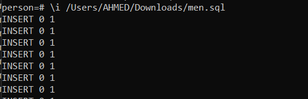

# **"Hallo homie, hope you be pretty good and keep yourself as I left you."**

## Topics
- [**"Hallo homie, hope you be pretty good and keep yourself as I left you."**](#hallo-homie-hope-you-be-pretty-good-and-keep-yourself-as-i-left-you)
  - [Topics](#topics)
    - [Important websites](#important-websites)
    - [Important Notes](#important-notes)
    - [Commands \& Functions](#commands--functions)

### Important websites 
1. [Mockaroo](https://www.mockaroo.com/)
1. [PostgreSQL](https://www.postgresql.org/)
### Important Notes
- ```help``` can be used only when ```=``` exist 
-  THE DIFFRENCE BETTWENN   ```=``` & ```-```     ```\``` & ```/``` just you can imagin the commands in the boxes or groups there is a key to open the whole box ```\``` & ```=``` and there is a different one which open the smaller one ```/``` & ```-``` ,if you want to exit from one group press ```;```<details><summary> **Foto** </summary></details>
- ```COUNT(*)``` is a fun from aggeregation funcations there is alot of them you can vist this site to know more [postgres](https://www.postgresql.org/docs/11/functions-aggregate.html) in this like you may face this fun like  ```max() , min(), avr(), round``` note aggregate function calls can't be nested
- you have only one ```ELSE ``` and ``` END ``` per ```CASE``` but  multi ```WHEN```
- If you want to delete a row in sub-table you must at first delete any record has this foregin key this will be done by 3 ways the first is to delete the record ,second is to update these columns by NULL value third is to make cascade method but this is a bad practice because it will delete every record that has this foregin key
- A nice trick when the foregin key and primary key has the same name it is better to use ```USING ```
- **EXTENSIONS** to know what is the new funcation that has been added press \df we used uuid instead of orignial id with only integar number because it so difficult to attackers to guess the exact id and it is possible to migrate two database without any clashes because all id is different not like just integers 1,2,3,4,5 <details><summary>**Foto**</summary>  </details>
- to export your table to a CSV file you type <details><summary>**Foto**</summary></details>
- to know what is the last id you have or the last variable that type is bigserial is you can this doing by or if you want to increment these bigserial just use the entire funcation under default after SELECT<details><summary>**Foto**</summary></details>

### Commands & Functions
- ```\!``` CLS** TO CLEAR SCREEN 

- ```\c``` to connect to another database you can connect to specific things not all database use commands below ,but ```\c``` is easy and common<details><summary>**Foto**</summary></details>
- ```CREATE DATABASE``` "NAME" & ```DROP DATABASE``` "NAME" create and remove whole database just like ```DELETE FROM``` "NAME" but this delete only table or column if you specific this <details> <summary> **Foto** </summary>  </details>
- CREATE TABLE ***men*** to create table  in my database **person**  but first must be connect to this database , you have to know the [data types](https://www.postgresql.org/docs/current/datatype.html)  \dt show details about tables in your current database <details><summary>**Foto**</summary></details>
- to insert new record use  enter the data between ' '  note that if you enter date you must enter DATE '2002-03-30'<details><summary>**Foto**</summary></details>
 to insert multi records use ```\i``` command and put the path of your SQL file note that ```/``` in your path not ```\```if you want any date visit Mockaroo <details><summary>**Foto**</summary></details>
- To Read from tables use ```SELECT```<details><summary>**Foto**</summary> </details> 
- to sort cloums use ```ORDER BY``` with ```DESC``` or ```ASC``` (however ASC is the defult) , this command is the last command we write <details><summary>**Foto**</summary></details>
- to remove duplicateied date and to only know what is the unique date that we have and how many use``` DISTINCT```<details><summary>**Foto**</summary></details>
- you can also add conditions by using ```WHERE``` keyword you can inaddtion use ```AND```  ```OR``` to have specific condition ,you have a compersion operator like ```< ,>, =,<> ,<=,>= ```and it will return t or f or return the query that provides these conditions<details><summary>**Foto**</summary></details>
- to get range of some number you can use ```BETWEEN``` that have the same functionalty<details><summary>**Foto**</summary></details>
- you can know how many this data apper or duplictied by using ```GROP BY``` key word but you should use also ```COUNT()``` <details><summary>**Foto**</summary></details>
- to make any condtions on grop we use ```HAVING``` and put the condition in ```COUNT(*)```<details><summary>**Foto**</summary></details>
- there is a fun to bring data -used with ```WHERE``` -that is like to what you looking for is called ```LIKE``` or ```ILIKE``` there are not pretty diffrenet between them only ```ILIKE``` is not case senstive... yoy can add a ounch if underscores to indicate how many letters you want to be found only in your query<details><summary>**Foto**</summary></details>
- ```AS``` key word change the name of the column that you have added or any variable or long name you have to makr it easy to operate with them and we write it at the end of name of any column<details><summary>**Foto**</summary></details>
-  ```COALESCE``` key word used to fill null values with a specific character ,**Note that** don't forget ```' '```<details><summary>**Foto**</summary></details>
-  ```NULLIF``` key word used to cheak if the two passing numbers are equl so it returns ```NULL``` or return the very first value it is good way to handel divide by zero insted of get error message you get null or zero if you use ```COALESCE``` <details><summary>**Foto**</summary></details>
-  ```NOW()``` function return an actual date with time and time zone if you want a piece of it just type ```::``` , if you want a specific part you can use ```EXTRACT```<details><summary>**Foto**</summary></details> , if you want to add or substract date from each other use ```INTERVAL ' '```and you can write any time between partices 1 YEAR, 6 MONTH ,10 DAY , there is also a special fun from ```INTERVAL``` called ```AGE('ending','starting')``` <details><summary>**Foto**</summary> </details>
-  if you want to add a ```PRIMARY KEY``` constraint[for rows] or ```UNiQUE``` constraint [for column] use ```ALTER TABLE``` <details><summary>**Foto**</summary></details> to remove any of them use ```ALTER TABLE 'name' DROP``` <details><summary>**Foto**</summary></details>
```CHECK(condition)``` that can be drive to table by the same way to declear any constraint it used to put a specific constraint depends on the condition--- to remove a specific rows use ```DELETE FROM men WHERE ```to remove all table use  ```DROP TABLE men ;```or```DELETE FROM men ;``` <details><summary>**Foto**</summary></details>
- ```CASE``` keyword is the correspondent(equivalent) of ```IF``` in the another langauage However PostgreSQL has its ```IF``` conditions too it only return ```0``` or``` 1```<details><summary>**Foto**</summary></details>
- ```UPDATE```to update(edit or add) a column or more in one record or more depend on ```WHERE``` Clause record <details><summary>**Foto**</summary></details>
- to handel duplicate key conflict which comes throw because of constraints by using 
```ON CONFLICT``` ( name of any column has a constraint either primray key or unique constraint) ```DO NOTHING```this is useful when database catch a conflict it will continue and go on it will only do nothing ,, but if you want to udpate some date or client enter two diffrent data you must pick up throw lastest one so you want to do UPDATE this is allowed using this ```ON CONFLICT (id) DO UPDATE SET email= EXCLUDED.email;```**NOTE that** the first ```email``` referece to the ```email``` which stored and ```.email``` referece to ```email``` that just pass or want to insert you can add  columns as you want to change but remmber to change it first when you insert these using ```INSERT``` <details><summary>**Foto**</summary></details>
- **Relation** between tables in postgreSQL it will be by using Foreign key it is a primary key that refrece to another primary key in another table and be wrriten in table details when be created in the first time or be added  like that```car_id BIGINT REFERENCES car(id), UNIQUE (car_id) ;```which ```id``` referece to ```id``` in another table and ```car_id``` referece to th actual table the most important thing you must write sub-tables in the first then write the main one which has a relations with them <details><summary>**Foto**</summary></details>
- **inner joins*** we can grab data from table and its relations by using ```JOIN``` like that ,after JOIN we write what is the point or column that makes relation between these table ,,, write it like Objects
- ```LEFT JOIN``` is like ```JOIN``` but in ```JOIN``` it discards the data that has NULL value in the relation column or the foregin key however ```LEFT JOIN``` grab all data in the main table with the intersections too ,like ```JOIN ```.<details><summary>**Foto**</summary></details>
